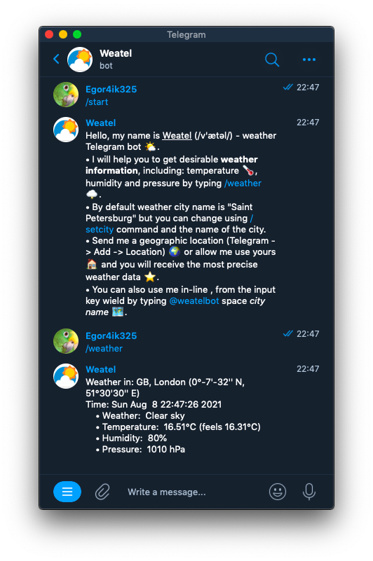

# Telegram OpenWeatherMap API bot

This is Telegram interface for querying weather data in different geographic locations.

Features:

- [x] /weather command search
  * change city
- [x] in-line mode search
- [x] search by geographic coordinates
